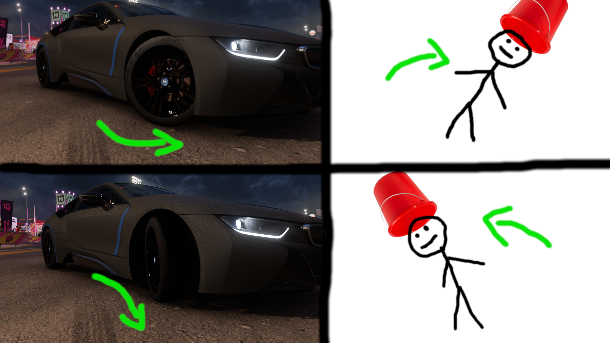

# Motion Steering Wheel
Control cars in racing games with a camera.  
The program emulates an Xbox controller. You can control it by moving a red object in front of the camera.
By moving the object you can move the (emulated) left joystick to the left/right.

You can track your movements by putting something red on your head. (for example a red bucket)



```
sudo -E python main.py
```

## Setup
1. Download the "main.py" script.
2. Install following using pip or your package manager: opencv (pip), numpy (pip), evdev (pip), ffmpeg (package manager), python3.11 (package manager)
3. To emulate a controller, the script needs root privileges. to show you a visualisation, the script needs environment variables. Therefore use "sudo -E".
4. Start the script using "sudo -E python main.py".

## How it works
1. The image from your camera (for example a webcam) is taken as input.
2. Python isolates the red pixels using OpenCV.
3. The detected red areas are merged or removed according to size (OpenCV).
4. The locations are being detected using blob detection (OpenCV).
5. The horizontal position of the object gets determined.
6. Python creates an input device with evdev UInput.
7. The horizontal position of the object is applied to the (emulated) left joystick (evdev, UInput).
